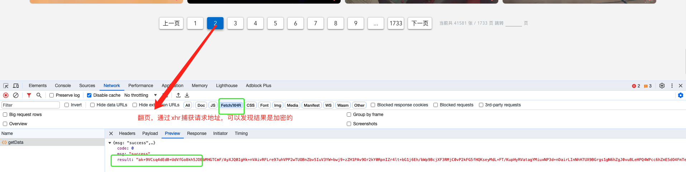
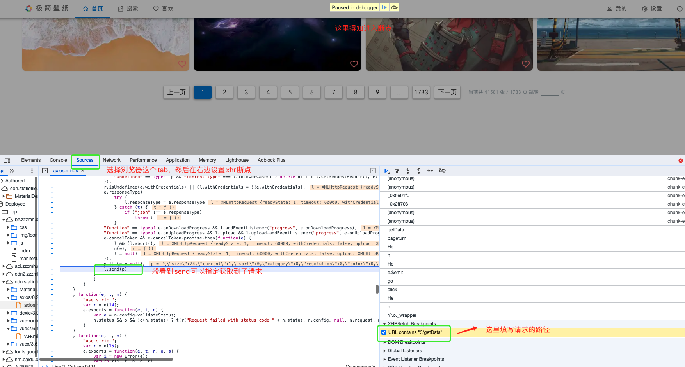
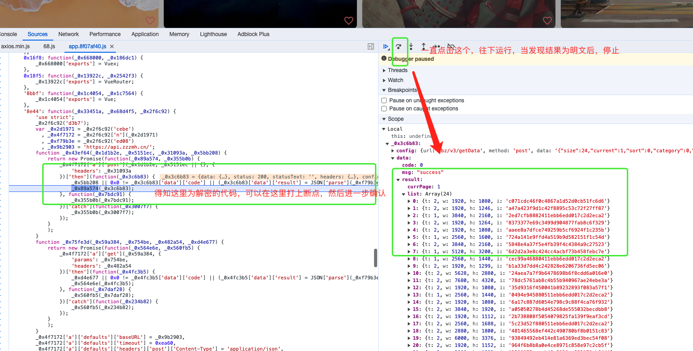
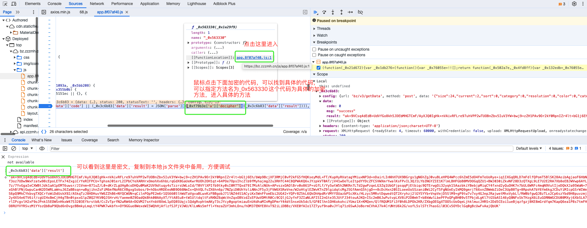
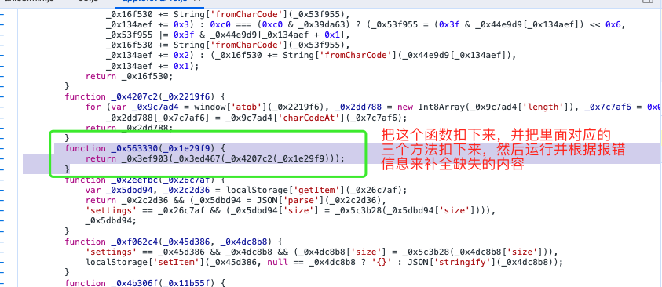
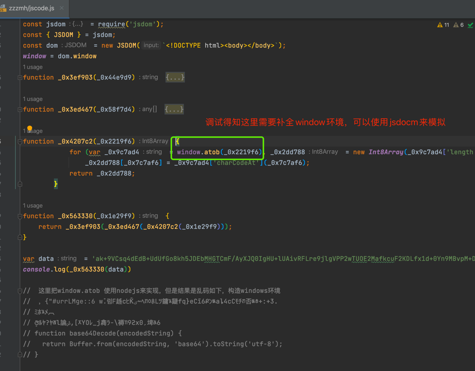
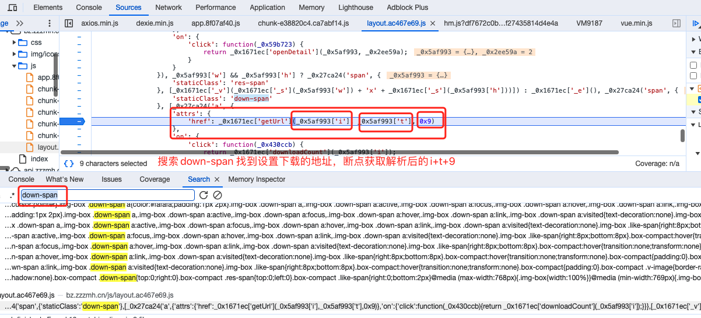
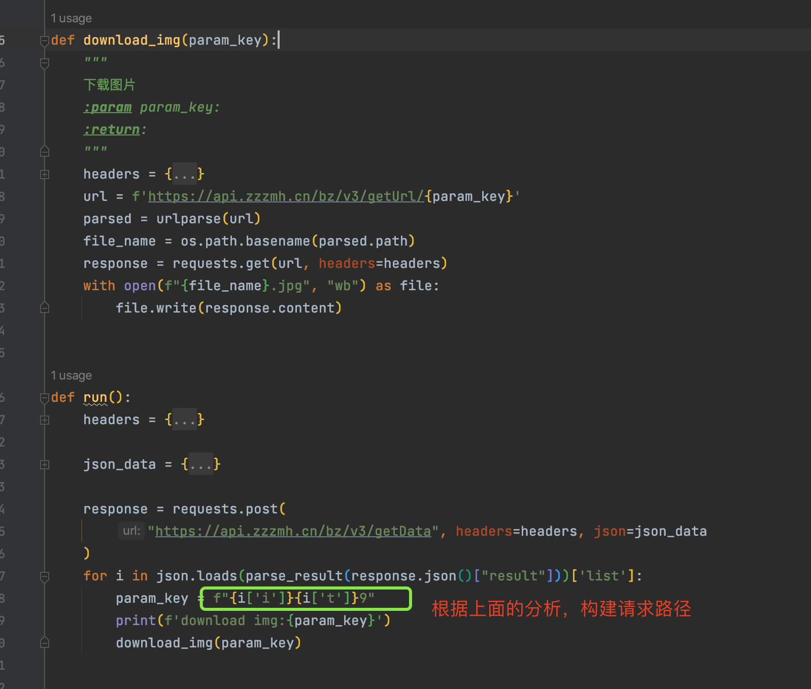

### 极简壁纸逆向分析
1、抓包分析请求

2、常规思路搜索关键词 decrypt( JSON.parse发现搜索不到,使用xhr监听断点，来进行追栈

3、往下追踪，获取到明文的结果，停止

4、找到加密的方法

5、把解密的方法复制到本地js文件中

6、运行下面的代码，需要使用nodeJs环境，依赖jsdom可以使用npm install jsdom进行安装

7、pyhton环境中调用js代码，PyExecJS,可以pip install PyExecJS进行安装

8、封装下载接口，下载的地址也需要通过debug来找到其组合规律

